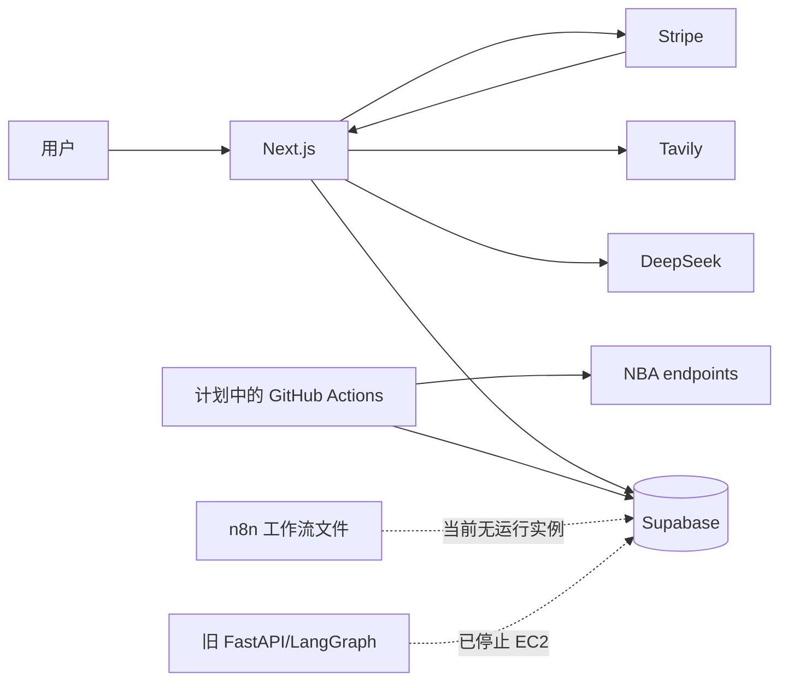
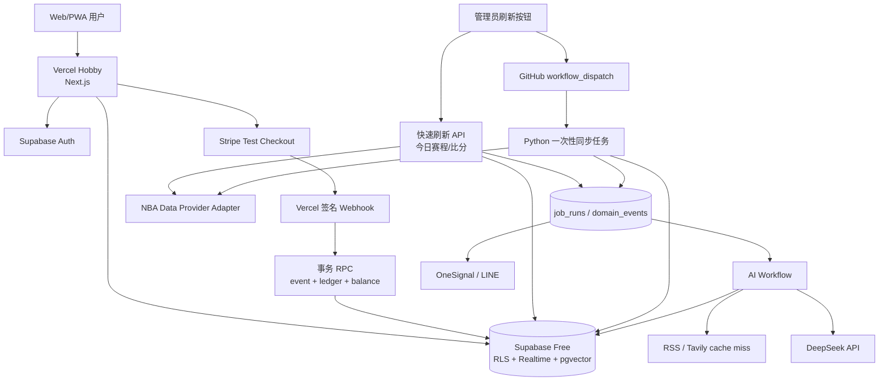

# NBA Game with Friends：全 Serverless 架构设计与迁移审计

> 状态：架构方案 v2，已纳入 2026-09-10 产品决策；不包含生产资源删除或部署操作<br>
> 审计日期：2026-09-10（Asia/Tokyo）<br>
> 范围：`apps/web`、`services/ai-agent`、`services/data-sync`、`functions/payment`、`infrastructure/n8n`、`infrastructure/terraform`、GitHub Actions、Supabase 实际项目、AWS 实际账户

> 2026-09-12 补充：学习优先的实施顺序以 [NBA AI 工程学习实践方案](nba-ai-learning-practicum.zh-CN.md) 为准。本次仅更新材料，未重新验证线上资源或执行部署。以下费用与平台限制均须以实际账户配置和最新官方条款为准。

## 1. 结论先行

这个项目可以彻底去掉常驻 EC2、Lightsail、自建 n8n 和独立 FastAPI AI 服务，同时保留现有 Next.js、Supabase、Stripe 和 Python 数据同步代码的大部分投资。

根据产品方确认的“个人展示、Stripe 测试模式、手动刷新、任意五人、好友榜属于 MVP、阵容生成扣 credit、Supabase Free 优先”，推荐的目标组合调整为：

| 领域 | 推荐组件 | 选择理由 |
|---|---|---|
| Web、SSR、短 API | Vercel Hobby | 项目已原生适配 Vercel；个人非商业展示符合 Hobby 条款；固定成本 $0，迁移量最小 |
| 数据库、Auth、Realtime、Vector | Supabase Free | 继续使用现有 PostgreSQL、RLS、Auth 和 pgvector；接受低活跃项目可能被暂停 |
| 今日比分快速刷新 | Vercel Route Handler | 仅管理员可触发；用轻量 TypeScript 请求更新今日赛程/比分，采用项目自定的 60 秒执行预算 |
| Python 全量/高级数据同步 | GitHub Actions `workflow_dispatch` | 公开仓库标准 runner 免费；需要时人工触发，执行完即释放，不承担实时 SLA |
| 重型同步后备 | Google Cloud Run Jobs（暂不启用） | 如果 GitHub Actions 启动速度、代理或运行时间不满足，再迁移；按执行付费、可缩到零 |
| 异步状态 | Supabase `job_runs` + Realtime | 页面可显示排队、运行、成功、失败；当前规模不需要额外队列产品 |
| AI 推理 | DeepSeek Flash 类模型，结构化单次调用 | 保留低价模型；不为当前问题引入多 Agent 固定开销 |
| 搜索与新闻 | RSS/官方数据优先，Tavily 仅做缓存未命中补充 | 避免每个用户、每场比赛重复搜索 |
| 通知 | OneSignal + LINE REST API | 按事件直接调用，不再为几个工作流养一台 n8n 服务器 |
| 支付 | Stripe Test Mode Checkout + 签名 Webhook + Supabase 事务 RPC | 完整展示购买流程但不收真实款项；仍按生产标准处理鉴权和幂等 |
| IaC | Supabase migrations + Vercel/GitHub 配置 | 基线不再需要新云厂商 Terraform；旧 AWS Terraform 进入只读归档 |

在符合免费计划条款且未超额度的前提下，不计域名、NBA 代理和实际 AI token，应用固定基础设施可以做到 **$0/月**。模型与搜索费用取决于所选服务的实际计费和用量；NBA 代理能否按量付费尚未确认，不能假设没有最低月费。若保留 Route 53，先前审计估算仍约 $0.50/月；其余 AWS 残留资源应在核实依赖并获得授权后处理。

这里的“完全 Serverless”定义是：没有需要人工维护、补丁升级或 24 小时付费的 VM；Web 按请求执行、数据同步按人工任务执行。GitHub Actions 和可选 Cloud Run Jobs 都不产生常驻实例。

这不等于所有底层服务都自动缩容至零：Supabase Free 是托管数据库，低活跃时可能暂停，展示前需要检查并必要时手动恢复。[官方暂停说明](https://supabase.com/docs/guides/platform/free-project-pausing)

## 2. 业务理解

从现有页面、数据库和服务推断，当前产品包含以下业务：

1. 浏览 NBA 赛程、比分、球队、球员、排名和投篮数据。
2. 用户通过 Google、短信或邮箱登录。
3. 用户为指定比赛日选择 5 名首发球员并提交阵容。
4. 根据球员真实比赛数据计算 fantasy 得分。
5. 展示用户阵容、比赛结果和朋友排行榜。
6. AI 提供赛前预测和“一键生成阵容”，每次消耗一个 AI credit。
7. 用户通过 Stripe 一次性购买 5 个 AI credits。
8. 比赛开始、结束或数据异常时通过 OneSignal/LINE 通知。

已确认：项目是个人展示；Stripe 只使用测试环境；数据允许约 15 分钟或更久的陈旧度并由管理员主动刷新；阵容可任选五人；好友榜属于 MVP；一键阵容扣 credit；Supabase Free 优先。尚未指定的锁定、时区和榜单细节采用第 17 节默认值，不再阻塞架构实施。

## 3. 当前实现盘点

### 3.1 代码中的五个运行单元

| 单元 | 当前技术 | 历史部署方式 | 当前方向 |
|---|---|---|---|
| `apps/web` | Next.js 15、React 19、TypeScript | Vercel | 正在把 AI 与支付 API 合并进 Next.js |
| `services/ai-agent` | FastAPI、LangChain、LangGraph | EC2/Railway | 已被新的 TypeScript 路径部分替代 |
| `services/data-sync` | Python、`nba_api`、pandas | EC2 常驻 worker | 本地未提交改动准备迁到 GitHub Actions |
| `functions/payment` | Node Lambda、Stripe | Lambda + API Gateway | 本地未提交改动准备迁到 Next.js Route Handler |
| `infrastructure/n8n` | n8n + Caddy | Lightsail | 实际 Lightsail 已不存在，工作流仍留在仓库 |

### 3.2 Supabase 实际数据快照

审计时数据库在线。主要数据量如下：

| 表/视图 | 行数 |
|---|---:|
| `games` / `games_tokyo` | 1,248 / 1,248 |
| `players` / `teams` | 532 / 30 |
| `game_player_stats` | 34,678 |
| `game_player_advanced_stats` | 16,896 |
| `player_season_stats` | 520 |
| `player_season_advanced_stats` | 566 |
| `player_shots` | 101,503 |
| `documents` | 1,622 |
| `task_queue` | 4,820 |
| `users` | 5 |
| `user_daily_lineups` / `lineup_items` | 4 / 20 |
| `friendships` | 0 |
| `payments` / `payment_transactions` / `webhook_events` | 42 / 25 / 38 |

数据库并没有被完整地版本化。仓库中只有支付和部分数据同步的增量 SQL，没有能够从空库重建核心表、RLS、触发器、视图和函数的权威迁移集。这是灾难恢复和环境复制的主要缺口。

### 3.3 实际云资源状态

- AWS EC2 `nba-game-ai-agent` 仍存在但已停止；8 GiB gp3 EBS 仍挂载。
- Elastic IP、Lightsail、Lambda、API Gateway 已不存在。
- 两个 EC2 开关机 Scheduler 仍为 `ENABLED`，但其 IAM role 已被删除。
- Secrets Manager、Route 53 和少量日志/ECR 仍产生成本。
- 2026-09-01 至 2026-09-10 的 AWS 已发生成本约 $1.03（含税）；按当前残留资源粗略外推约 $1.4–1.6/月。
- Terraform state 与真实 AWS 发生大面积漂移。直接执行现有 `terraform apply` 有重建旧 Lambda、API Gateway、EIP、IAM 和 SNS 的风险。
- 已知生产域名、预览域名和 n8n 地址均不可用；历史部署链接返回 404、410 或无法访问。
- GitHub 远端仍保留三个旧 AWS 部署工作流；新的 `nba-data-sync.yml` 只存在于本地未跟踪文件中，因此远端并没有运行新的定时同步。

这说明当前状态不是“已完成 Serverless 迁移，只差删除资源”，而是“代码迁移进行中，线上切换尚未完成，IaC 与真实环境不一致”。

## 4. 当前核心流程与缺口



### 4.1 赛前预测

新 `/api/predict` 路径的实际流程是：鉴权 → 扣 credit → 查询确定性数据 → Tavily 搜索 → 单次 DeepSeek 调用 → SSE 返回。

优点是成本比旧 LangGraph 多 Agent 低很多。问题是：

- 输入校验发生在扣 credit 之后，失败时用普通 `UPDATE` 退款，存在并发丢失更新。
- UI 中的“多 Agent 阶段”主要是进度文案，不是真正的独立 Agent 或审核闭环。
- 与旧服务相比，伤病、球星趋势、赛程压力、历史交手、新闻向量检索和 reviewer 能力有所回退。
- 每个用户请求都重新搜索和推理；同一场比赛应只生成一次共享结果。

### 4.2 一键阵容

新 `/api/lineup/generate` 会读取赛季平均 fantasy 得分并排序取前五名。它没有模型调用，也没有伤病、近期状态、赛程、对手、位置、预算或组合约束优化，但仍消耗 AI credit，并通过延时制造“AI 正在思考”的进度。

这既是产品可信度问题，也是错误的成本模型。推荐把它改成可解释的确定性优化器；LLM 只负责用自然语言解释选择，不参与选人真值计算。

### 4.3 阵容提交与结算

- 提交由多次独立 `UPDATE`、`DELETE`、`INSERT` 构成，不在单个事务中。
- 只校验 5 人，没有数据库级唯一球员、可选比赛、位置、锁定时间、修改次数等约束。
- 没有发现比赛结束后持久化阵容总分、结算状态和每日排行榜的流程。
- Matchups 页面会在读取时即时计算，并在当日阵容不存在时回退到“最近阵容”，可能展示错误比赛日。
- “朋友排行榜”目前是前端 mock；`friendships` 实际为 0 行。

### 4.4 数据同步

- Python 服务对部分 NBA API 最多重试 30 次，单请求超时 60 秒，并带指数等待；这可以超过 GitHub workflow 的 15 分钟限制，也超过 Lambda 的 15 分钟硬上限。
- 本地新 workflow 每天只运行 5 次，只同步昨日/今日赛程比分，没有按 live game 持续同步 box score，因此无法支持页面上的 “LIVE UPDATES”。
- `sync-all` 包含清表和逐行删除逻辑，失败恢复风险高。
- 任务领取是先 `SELECT` 再条件 `UPDATE`，但没有严格确认领取成功，多 worker 时可能重复处理。
- 代码已经承认 `stats.nba.com` 存在云 IP 阻断或限流风险，但新 workflow 没有配置代理。

NBA 数据源本身是架构之外的关键依赖。即使计算完全 Serverless，也不能把非正式上游接口当成有 SLA 的数据服务。目标实现必须提供 provider adapter、限流、缓存、失败降级和数据新鲜度展示。

## 5. 必须先处理的风险

### P0：上线前阻断项

1. **支付会话可被未认证调用。** `create-session` 接受客户端传入的任意 `userId` 和任意 `price_*`，使用 service role 执行，没有验证登录用户、服务端产品白名单，也信任请求 `Origin` 生成回跳地址。
2. **credit RPC 权限边界不安全。** `decrement_ai_credit`、`grant_ai_credits` 使用 `SECURITY DEFINER`，但迁移中没有固定 `search_path`、没有 `auth.uid()` 归属校验，也没有显式撤销 `PUBLIC EXECUTE`。其中 grant 必须只允许 service role。
3. **支付幂等不是事务性的。** Webhook 先检查事件、再发放 credit、最后记录事件；并发或中途失败可能重复发放或留下不一致状态。
4. **用户敏感字段匿名可读。** 实测 anon key 能读取 `users` 的全部 5 行及 credit 余额。应将公开资料拆为 `public_profiles`，私有账户字段只允许本人/服务端访问。
5. **依赖包含已知高危漏洞。** `npm audit --omit=dev` 报告 7 个生产依赖漏洞：1 critical、5 high、1 moderate；Next.js 是直接 critical 依赖，存在可用升级修复。
6. **公开仓库包含历史明文凭证/固定身份配置。** `infrastructure/scripts/ec2-init.sh` 中存在实际形态的 n8n Basic Auth 密码；应旋转凭证并评估清理 Git 历史。LINE 接收者和 OneSignal App ID 也应移入环境配置。

### P1：首个可用版本前完成

1. 阵容提交改成一个事务 RPC，并增加唯一性、资格和锁定规则。
2. 比赛结束结算改成异步、幂等、可重跑的工作流。
3. 删除 `matchups.ts` 中 service-role key 前缀、JWT、所有用户 ID、固定 `id=5` 等调试日志和全表查询。
4. 生产错误不能回退到硬编码 mock 比赛。
5. 为同步任务增加 job lease、幂等键、最大尝试次数、死信状态和 checkpoint。
6. 所有 n8n SQL 字符串插值替换为参数化 SQL；迁移后停用 n8n。
7. Python 依赖由宽泛的 `>=` 改为 lockfile/固定版本。

### P2：稳定性与维护性

- 移除没有调用者的浏览器侧 AWS CloudWatch/SNS 代码和 AWS credentials 依赖。
- 修复 ESLint Next 插件未加载、`` 警告和两处尾随空格。
- 把 700 多行的 matchup 查询拆成查询、映射、评分三个纯模块。
- README、`.agents/rules/*`、部署脚本和实际架构同步更新，旧架构文档通过 ADR 明确废弃。

## 6. 方案比较

| 方案 | 固定成本 | 迁移量 | 生产适用性 | 主要问题 |
|---|---:|---:|---|---|
| **A. Vercel Hobby + Supabase Free + 手动 GitHub Actions** | **$0** | **最小** | **个人展示，推荐** | Supabase 低活跃会暂停；GitHub job 启动不是即时的 |
| B. Vercel Hobby + Supabase Free + Cloud Run Jobs | 小流量通常 $0 | 小到中 | 个人展示/小型服务 | 多一个 GCP 项目和身份配置，但任务执行更可控 |
| C. Cloud Run Service + Jobs + Supabase | 小流量可能 $0 | 中 | 中高 | Web 冷启动、域名/CDN 和部署体验不如当前 Vercel 路径 |
| D. Cloudflare Workers + Supabase + Cloud Run Jobs | $5/月起 | 中等 | 商业小型生产 | 对当前个人展示没有必要的固定费用和 OpenNext 迁移 |
| E. Vercel Pro + Supabase Pro + Cloud Run Jobs | $45/月起 | 小 | 正式商业生产 | 当前目标用不到它提供的保障 |

选择 A 是因为真实收费已经排除，Vercel Hobby 的非商业限制不再构成问题；现有 Next.js 不需要适配新运行时。GitHub Actions 只在管理员要求刷新时运行，不依赖 schedule 的准时性。

Cloud Run Jobs 保留为清晰的升级开关，而不是首日组件：如果以后需要稳定的 API 触发、任务超过 GitHub 合理运行窗口，或需要更严格的重试/并行控制，再把同一个 Python 容器迁过去。Cloud Run 按资源使用计费并能缩到零，因此也不存在无展示时的常驻费用。

## 7. 目标架构



### 7.1 运行边界

**Vercel Function 只做短请求：** 页面渲染、鉴权 API、读取聚合数据、Stripe Test Checkout、Webhook、AI 调用，以及能在 60 秒内完成的今日比分刷新。不要把 Python 全量同步塞进用户请求。

**Supabase 是唯一事实源：** 比赛、球员、阵容、支付、credit ledger、AI artifact、任务状态都以 PostgreSQL 为准。客户端只使用 anon key + RLS；service role 仅存在于服务端 secret store。

**GitHub Actions 只做人工批任务：** 赛季全量、advanced stats、shots、历史回填和修复。任务执行完即退出；Cloud Run Jobs 是需要更强运行保障时的按量升级选项。

**工作流只传引用，不传大数据：** 事件中保存 `game_id`、`job_id`、版本和 trace ID；各步骤从数据库读取需要的数据，避免在队列/Agent 状态里复制整场 box score。

## 8. 数据同步工作流设计

### 8.1 管理员按需刷新工作流

不设置常驻 cron。页面始终先展示 Supabase 中已有数据，同时显示 `最后更新时间`、`数据年龄` 和 stale 标签。只有管理员可以执行刷新：

1. **刷新今日数据：** `/api/admin/sync/today` 使用轻量 TypeScript provider 获取当天赛程、比分和必要 box score，目标在项目自定的 60 秒预算内完成。2026-09-12 查证：启用 Fluid Compute 的 Hobby 函数默认及最大时长为 300 秒；60 秒是本项目的响应与费用控制目标，不是当前平台上限。实际仍需检查项目是否启用 Fluid Compute。[官方时长文档](https://vercel.com/docs/functions/configuring-functions/duration)
2. **刷新完整数据：** `/api/admin/sync/full` 创建 `job_runs` 记录并触发 GitHub Actions `workflow_dispatch`；现有 Python 服务执行赛季、advanced stats 或 shots 同步。
3. 前端通过 Supabase Realtime 或低频轮询显示 `queued/running/succeeded/failed`，完成后重新加载数据。
4. 普通访客无权触发上游访问，避免公开按钮被滥用而消耗代理和 API 配额。

15 分钟不再是定时刷新频率，而是 UI 判断 `stale` 的建议阈值。数据超过 15 分钟仍可展示，但明确提示用户手动刷新。

状态机：

```text
scheduled -> pregame -> live -> final_pending -> finalized
                         |             |
                         v             v
                     retry_wait     settle_lineups
                                         |
                                         v
                                  leaderboard_ready
```

每次执行需要：

1. 使用 `provider + game_id + data_type + source_updated_at` 作为幂等键。
2. 先领取 lease，再调用上游；lease 超时可由其他 worker 接管。
3. 对同一场比赛的 scoreboard、box score 执行批量 upsert，不做逐行 delete/insert。
4. 只有状态边沿变化，例如 `live -> final`，才写入 `domain_events`。
5. 失败按指数退避并加随机抖动；429 尊重 `Retry-After`。
6. UI 显示 `source_updated_at` 和 stale 状态，不能用 mock 冒充实时数据。

### 8.2 人工重批处理工作流

使用一个可带参数的 workflow，而不是多个 schedule：

```text
workflow_dispatch(mode, date, season, game_id)
  -> validate input
  -> claim job lease
  -> run bounded Python sync
  -> batch upsert
  -> persist checkpoint and freshness
  -> settle finalized games
  -> update job status / notify owner
```

`mode` 至少支持 `today`、`season-stats`、`advanced-stats`、`shots`、`game`、`backfill`。每个模式都有自己的最大运行时间和重试上限，不再用会清空多张表的 `sync-all` 作为普通入口。

如果 GitHub Actions 后续不能满足代理网络、启动速度或运行时间要求，仅将这一 workflow 的容器执行端替换为 Cloud Run Jobs，数据库协议和页面交互保持不变。

## 9. AI 与自动化设计

### 9.1 不建议现在恢复多 Agent

当前赛前预测是“固定数据收集 + 一次生成”的问题。多 Agent 会增加 token、延迟、失败面和调试成本，却没有足够的自主决策价值。推荐明确的确定性工作流：

```text
读取比赛 -> 生成统计特征 -> 获取共享新闻/伤病缓存
-> 规则校验数据完整性 -> 单次结构化 LLM 生成
-> JSON Schema 校验 -> 写入版本化 artifact -> 发布
```

只有出现以下需求时再使用 LangGraph：多分支工具选择、人工审批、长时间暂停恢复、多个 specialist 真正独立产出、需要 checkpoint 回放。那时应使用持久化 checkpoint、最大步数、最大 token/费用、工具 allowlist 和 trace ID，而不是把 UI 进度文案当成 Agent。

### 9.2 推荐的 AI 功能优先级

#### 1. 每场一次的赛前预测

- 以 `(game_id, model, prompt_version, data_version)` 缓存。
- 触发方式为：管理员刷新今日数据后为即将开始的比赛生成，或第一个用户请求发生 cache miss 时按需生成；不需要 cron。
- 所有用户读取同一个基础预测；付费 credit 解锁详细解释，而不是重复生成。
- 输入包含基础/advanced stats、近况、休息天数、主客场、伤病和新闻摘要。
- 输出严格 JSON：胜率、关键因素、风险、数据时间、置信度；不允许自由文本成为唯一存储格式。

#### 2. 真正的阵容优化器

- 用规则/优化算法产生阵容：候选池过滤、伤病、比赛资格、位置、近期加权得分、对手防守和风险偏好。
- 因业务允许任选五人，第一版可使用透明评分：赛季标准化 fantasy 得分 35% + 最近 5 场 30% + 预计上场时间趋势 10% + 对手 matchup 15% + 休息/可用性 10%，伤停和数据陈旧作为 penalty；权重写入版本化配置而非 prompt。
- 上述权重只是待验证的实验假设，并非经过回测的预测模型；必须与简单基线在按时间隔离的数据上比较。缺少必要输入时应明确降级，不能让 LLM 补造数据或未经校准的胜率。
- 先生成候选 Top 10 和确定性 Top 5，再让 LLM 解释五人选择、风险和两个替补；这样展示效果丰富但结果可测试。
- LLM 只解释“为什么选择这五人”和替代方案。
- 即使 LLM 失败也能返回可用阵容。
- 若仍消耗 credit，UI 必须准确说明用户购买的是“优化 + AI 解释”，而不是伪造推理进度。

#### 3. 个性化赛后复盘

- 比赛 final 后先结算确定性得分。
- 只为实际提交阵容的用户生成短复盘；相同球员组合可复用片段。
- 推送“本日得分、最佳选择、最大遗憾、排名变化”。

#### 4. 数据质量 Copilot

- 规则先检测：缺失 box score、比分倒退、球员分钟异常、长时间未更新。
- 只有异常时调用 LLM，把日志和差异压缩成人能读的处置建议并发送 LINE。
- LLM 不自动修改生产数据；修复必须走可审计 job。

#### 5. 新闻与伤病 RAG

- RSS 和可信来源按 URL/content hash 去重，一次摄取、多场比赛复用。
- 先用 PostgreSQL FTS；只有语义召回确实提升效果时才使用 pgvector。
- Tavily 只做 cache miss 或高价值比赛补充搜索，避免每次用户请求产生外部搜索费用。

### 9.3 AI 成本护栏

- 每用户、每 IP、每比赛三级 rate limit。
- 先校验请求和 credit，再创建 job；只在 job 成功发布时记账，或使用 reserve/commit/release ledger。
- Prompt 与输出长度设硬上限。
- 记录每次 `input_tokens`、`output_tokens`、模型、缓存命中、美元估算。
- 超出每日预算时降级到缓存预测或确定性摘要。
- 模型通过 adapter 调用，允许按价格、可用性切换，不把业务代码绑定到单一 SDK。

按 DeepSeek 当前 Flash 价格举例：每次 6k cache-miss 输入 + 1k 输出，1,000 次约 $1.12。若改为每场比赛一次而非每用户一次，一个常规赛季的基础预测成本仍在低个位美元量级；真实成本需用上线后的 token 记录校准。

## 10. 数据模型与事务边界

建议新增或重构：

| 对象 | 关键设计 |
|---|---|
| `public_profiles` | 只暴露昵称、头像；不包含 email、Stripe ID、credit |
| `credit_ledger` | 只追加；`purchase/reserve/commit/release/refund/admin` 类型；唯一业务幂等键 |
| `payment_events` | `stripe_event_id UNIQUE`，事件记录与 credit 发放在同一事务 |
| `ai_jobs` | 状态、输入 hash、用户/比赛、成本、错误、重试次数 |
| `ai_artifacts` | `game_id + type + model + prompt_version + data_version` 唯一 |
| `ai_unlocks` | 用户对 prediction/lineup artifact 的一次性 credit 解锁记录；相同 artifact 对同一用户不重复扣费 |
| `job_runs` | 调度、lease、attempt、checkpoint、source freshness、trace ID |
| `domain_events` | final、lineup_settled、prediction_ready 等边沿事件，带唯一键 |
| `lineup_scores` | 每个 lineup 的结算快照和规则版本，不在页面读取时临时重算 |
| `friendships` | `requester_id/receiver_id/status`，双向确认；唯一化规范化用户对，禁止自己加自己 |
| `leaderboard_snapshots` | 每日/赛季榜单快照，读取快且历史可追溯 |

必须用数据库事务/RPC完成：

- `submit_lineup(user, date, player_ids, rules_version)`
- `reserve_ai_credit(job_id, user)`
- `commit_or_release_ai_credit(job_id)`
- `apply_stripe_event(event_id, user, product, credits)`
- `settle_game(game_id, scoring_version)`

所有 `SECURITY DEFINER` 函数固定 `SET search_path`，显式 revoke/grant，并在函数内部验证调用身份。客户端不能直接传入需要信任的价格、credit 数或目标用户。

## 11. 安全设计

1. Stripe Checkout 只接收服务端定义的 `product_code`，再映射到环境对应的 `price_id`。
2. 从 Supabase session 获取 user ID，忽略客户端 userId。
3. success/cancel URL 来自固定 allowlist 配置，不读取任意 Origin。
4. Webhook 在读取 raw body 后验证 Stripe 签名；事件事务性幂等。
5. service role、Stripe secret、DeepSeek/Tavily key 只保存在平台 secret store。
6. GCP 部署用 GitHub OIDC/Workload Identity Federation，不保存长期 service-account JSON key。
7. RLS 以“默认拒绝”为起点，逐表覆盖 anon/authenticated/service role 用例并做自动化测试。
8. 对公开 API 设置 body 上限、schema 校验、超时、速率限制和审计 trace。
9. 旋转公开仓库中出现过的凭证；必要时使用 history rewrite，但这是单独的破坏性操作，执行前确认范围。

## 12. 可观测性与运行标准

不再把浏览器日志发送到 AWS SDK。统一输出结构化 JSON：

```json
{
  "level": "error",
  "service": "live-sync",
  "trace_id": "...",
  "job_id": "...",
  "game_id": "...",
  "attempt": 2,
  "duration_ms": 812,
  "error_code": "UPSTREAM_TIMEOUT"
}
```

最低监控指标：

- 比分数据年龄、最近成功同步时间、活跃比赛同步成功率。
- job pending/failed/dead-letter 数量和最长等待时间。
- Stripe webhook 成功率、重复事件、ledger 与余额对账差异。
- AI 成功率、P50/P95 延迟、缓存命中率、每次/每日成本。
- 页面错误率、SSR 延迟、数据库慢查询。

初期使用 Vercel、GitHub Actions、Supabase 原生日志并由异常 job 发送 LINE；需要跨平台检索时再接 Sentry 免费层。不要为了“统一监控”先引入新的固定付费平台。

建议 SLO：

- 管理员发起今日刷新后，60 秒内完成或明确切换为后台任务。
- 成功刷新检测到 final 后 10 分钟内完成 fantasy 结算。
- Stripe Test Checkout 完成后 60 秒内到账；任何 Webhook 可安全重放。
- 缓存命中的预测 P95 < 500ms；新生成预测 P95 < 30s。

## 13. IaC 与环境策略

### 13.1 不能直接应用现有 Terraform

当前 state 与云端严重漂移。迁移步骤必须是：

1. 备份 state 和真实资源清单。
2. 冻结旧 Terraform apply。
3. 对仍要保留的资源执行 import/state 修正；对已删除资源执行 state rm。
4. 新架构使用新目录或新 state backend，不与旧资源混在一个 root module。
5. 完成流量切换和观察期后，再单独审批销毁 EC2、EBS、Scheduler、Secrets、旧日志等残留。

### 13.2 新目录建议

```text
infrastructure/
  supabase/
    migrations/
    seed.sql
  github/
    workflows/          # 手动同步与 CI 的设计说明
  optional-gcp/         # 只有启用 Cloud Run Jobs 时才创建
    modules/
      cloud_run_job/
      workload_identity/
    environments/
      dev/
      prod/
  legacy-aws/           # 只读归档，明确禁止 apply
```

Vercel 与 GitHub Actions 不需要为“形式完整”额外引入 Terraform。若以后启用 GCP，Terraform module 需要固定 provider 版本、类型化变量、validation、least-privilege IAM、输出和示例，并使用独立 GCS state。Secrets 不写入 Terraform output 或 tfvars。

### 13.3 环境

- `dev`：Vercel Preview + 本地 Supabase；需要共享测试数据时才连接第二个 free project。
- `main`：Vercel Hobby Production + Supabase Free + GitHub Actions 手动同步。
- 本地：Supabase CLI + mock NBA fixtures；单元测试不能依赖真实 NBA endpoint。

Supabase 免费计划最多提供两个 active projects。为减少远端环境数量，日常开发优先使用 Supabase CLI，本项目只保留一个 hosted showcase project；未来真实商业化时再增加稳定 staging 并把 production 升级为 Pro。

## 14. 费用模型

### 14.1 个人展示基线

假设：个人非商业使用、低于 Vercel Hobby 配额、Supabase 数据低于 500 MB、低于 50k MAU、Python 只由公开仓库 GitHub Actions 人工执行、每月不超过 1,000 次 Tavily basic search。

| 项目 | 月成本估算 |
|---|---:|
| Vercel Hobby | $0 |
| Supabase Free | $0 |
| GitHub Actions（公开仓库标准 runner，人工触发） | $0 |
| OneSignal Free | $0 |
| Tavily Free 1,000 credits | $0 |
| DeepSeek | 按实际 token；低频展示通常低于 $1 |
| NBA 代理 | 现有不可避免费用 |
| Route 53 托管域名（若继续） | 当前约 $0.50 |
| **固定应用基础设施** | **$0；若保留 Route 53 则约 $0.50/月** |

Stripe 全程使用 Test Mode，不会产生真实交易费。若以后切换为 Live Mode，日本标准卡交易费当前为成功交易额的 3.6%。

Supabase Free 的代价是低活跃 7 天后可能暂停。对于个人展示，推荐接受暂停：演示前在 Dashboard 点 Resume，并在页面遇到 project paused 时显示明确维护提示。不要为了防暂停而制造无业务意义的 keep-alive 请求。

### 14.2 按量升级选项

| 触发条件 | 升级项 | 成本性质 |
|---|---|---|
| Python job 不适合 GitHub Actions | Cloud Run Jobs | 按 CPU/RAM 执行时间；可缩到零，低使用量可能落在免费额度 |
| 开始真实收费或需要数据库常在线/备份 | Supabase Pro | $25/月固定 |
| 变成商业站点且继续使用 Vercel | Vercel Pro | $20/月固定 |
| 需要商业边缘托管但不想付 Vercel Pro | Cloudflare Workers Paid | $5/月固定，但需要 OpenNext 迁移 |

因此当前不启用任何固定月费升级。先把执行端抽象为 job protocol，未来是否使用 GitHub Actions 或 Cloud Run 不影响业务代码。

### 14.3 官方价格与限制依据

- [Cloudflare Workers pricing](https://developers.cloudflare.com/workers/platform/pricing/)：Paid 最低 $5/月，含 10M 请求和 30M CPU ms；静态资源请求免费。
- [Cloudflare OpenNext adapter](https://developers.cloudflare.com/workers/framework-guides/web-apps/opennext/)：支持 App Router、Route Handlers、RSC、SSR、ISR 和 streaming；Node.js middleware 尚不支持。
- [Vercel Hobby](https://vercel.com/docs/plans/hobby) 与 [Vercel pricing](https://vercel.com/pricing)：Hobby 仅限个人非商业；Pro $20/月。
- [Supabase pricing](https://supabase.com/pricing)：Free 为 500 MB 数据库、50k MAU、500k Edge Function invocations；Pro $25/月、8 GB 数据库。
- [Supabase project pausing](https://supabase.com/docs/guides/platform/free-project-pausing)：低活跃 Free project 可能在 7 天后暂停，可在 Studio 恢复。
- [Supabase Edge Function limits](https://supabase.com/docs/guides/functions/limits)：Free 150 秒、Paid 400 秒、每请求 CPU 2 秒，不适合当前 Python 重任务。
- [Cloud Run pricing](https://cloud.google.com/run/pricing)：Jobs 按运行资源计费并有 CPU/RAM 免费额度。
- [Cloud Run Job timeout](https://docs.cloud.google.com/run/docs/configuring/task-timeout)：默认 10 分钟，可配置到 168 小时。
- [Cloud Scheduler pricing](https://cloud.google.com/scheduler/pricing)：每个 billing account 每月 3 个 job 免费，超出后 $0.10/job/月。
- [GitHub Actions billing](https://docs.github.com/en/actions/concepts/billing-and-usage)：公开仓库标准 hosted runner 免费。
- [GitHub scheduled workflows](https://docs.github.com/en/actions/reference/workflows-and-actions/events-that-trigger-workflows)：可能延迟、仅默认分支运行、公开仓库无活动 60 天会停用。
- [DeepSeek pricing](https://api-docs.deepseek.com/quick_start/pricing)：按 input/output token 计费。
- [Tavily credits](https://docs.tavily.com/documentation/api-credits)：免费 1,000 credits/月；basic search 每次 1 credit。
- [OneSignal pricing](https://onesignal.com/pricing)：Free $0，Growth $19/月起。
- [Stripe Japan pricing](https://stripe.com/jp/pricing)：日本标准卡成功支付 3.6%。

所有价格均可能变化；上线时必须以控制台区域、税费和当日官方页面重新核对。

## 15. 分阶段迁移计划

### Phase 0：冻结与定义，1–2 天

- 暂停旧 Terraform apply 和旧 AWS deploy workflows。
- 确认业务规则和生产 SLO。
- 导出 Supabase schema、RLS、函数和数据备份。
- 建立 `docs/adr/`，用 ADR 正式替代旧 `.agents/rules/deployment.md`。

验收：能从迁移文件创建空数据库；所有目标组件和费用上限得到确认。

### Phase 1：P0 安全修复，2–4 天

- 修复 Checkout 鉴权、价格白名单、固定 return URL。
- 创建事务性 Stripe event + credit ledger RPC。
- 修复 `SECURITY DEFINER` 和函数执行权限。
- 重建 users RLS / `public_profiles`。
- 升级 Next.js 和存在漏洞的生产依赖。
- 旋转泄露或疑似泄露的凭证。

验收：支付重放/并发测试通过；anon 无法读取私有字段；依赖无 critical/high 可修复漏洞。

### Phase 2：数据库一致性，3–5 天

- 阵容提交事务 RPC 和数据库约束。
- 建立 credit ledger、job_runs、domain_events、lineup_scores。
- 完成核心 schema baseline、seed、RLS 自动化测试。
- 删除生产 mock fallback 和敏感日志。

验收：失败注入不会留下半个阵容、重复 credit 或重复结算。

### Phase 3：Web Serverless，2–4 天

- 先升级到受支持的最新 Next.js 15 patch，修复安全漏洞。
- 部署到 Vercel Hobby；执行 Node API、Stripe Test、SSE、image、middleware 兼容测试。
- `dev` 使用 Preview；随后切 `main` 和域名。
- 保留旧入口 48–72 小时作为回滚路径，但不接收新的支付 Webhook。

验收：首页、Auth、阵容、预测 SSE、Stripe 测试支付、Webhook 全部通过；P95 和错误率达标。

### Phase 4：数据同步 Serverless，4–8 天

- 实现管理员“刷新今日数据”和“完整同步”两个入口。
- 把现有 Python 服务改为 GitHub Actions 一次性 command job，并支持 `workflow_dispatch` 参数。
- 引入 provider adapter、bounded retry、batch upsert、checkpoint 和 lease。
- 不配置生产 cron；在展示前或需要新数据时人工触发。
- 只有 GitHub Actions 不满足要求时才部署 Cloud Run Jobs。
- 对同一日期重复运行并做行级 diff，证明幂等性。

验收：按钮能展示任务进度；今日刷新在 60 秒内完成或安全转为后台 job；重跑不产生重复数据；上游 429/超时时正常退避。

### Phase 5：AI 与结算工作流，4–7 天

- 将预测改为每比赛预计算和版本化缓存。
- 实现任选五人的真实阵容优化器和 LLM 解释，每次成功生成扣 1 credit。
- 新用户建议赠送 3 个 demo credits；Stripe Test Checkout 成功后赠送 5 个，便于完整展示产品循环。
- final 事件驱动结算、排行榜和通知。
- 加入每日 AI 预算、token 记录、失败降级。

验收：同一 data/prompt version 不重复调用模型；LLM 故障不影响基本选阵容和结算。

### Phase 6：停用旧系统，需单独审批

- 停用并归档旧 EC2 deploy、payment Lambda、data-sync EC2 和 n8n workflows。
- 清理 EC2、EBS、Scheduler、Secrets Manager、旧日志和无用 Route 53 记录。
- 修正/拆分 Terraform state；保存最终账单和资源空清单。
- 更新 README、运行手册和 `.agents/rules/*`。

验收：AWS 仅保留明确需要的 DNS；连续 7 天无旧端点流量；新系统可从代码重建。

## 16. 测试与验收清单

- 单元：fantasy scoring、时区、阵容资格、price/product 映射、AI schema parser。
- 数据库：RLS 正反例、事务回滚、并发扣 credit、Webhook 幂等、重复结算。
- 合约：NBA provider fixture、Stripe signed webhook、DeepSeek/Tavily mock。
- E2E：注册 → 选阵容 → 购买 → 生成预测 → 比赛 final → 排行榜。
- 故障注入：NBA 429、LLM 超时、Webhook 重放、数据库连接失败、job 被中断后恢复。
- 数据对账：games/player stats 行数、source timestamp、credit ledger sum = balance、Stripe payment = ledger grant。
- 成本：Vercel 配额、GitHub Actions 时长、AI token、Tavily credits 和代理用量设置告警。

## 17. 已确认业务决策与默认值

| 业务项 | 决策 |
|---|---|
| 项目属性 | 个人展示，非商业运行 |
| 支付 | Stripe Test Mode，链接和卡号均为测试环境 |
| 数据新鲜度 | 允许约 15 分钟或更久；管理员主动刷新，不做持续轮询 |
| 阵容 | 任意五人，不要求 PG/SG/SF/PF/C，不设工资帽 |
| 好友榜 | MVP 必须实现 |
| 一键阵容 | 成功生成扣 1 credit，并升级为真实优化 + AI 解释 |
| 基础设施预算 | Supabase Free 优先，固定应用运行费尽量为 $0 |

未明确部分采用以下可修改默认值：

- 比赛日统一使用 JST，与现有系统一致。
- 每个用户每天一个阵容，可在第一位所选球员对应比赛开赛前修改；更稳妥的实现是当天第一场相关 NBA 比赛开赛时整体锁定。
- 好友为双向确认关系；展示每日榜和赛季累计榜，平分时并列。
- 新用户 3 个 demo credits；预测和阵容生成各扣 1，调用失败自动释放；读取完全相同的个人缓存不重复扣费。
- 数据源暂时接受非官方 NBA endpoint 的偶发不可用，并在 UI 显示最后更新时间；代理费用视为既有必要成本。

## 18. 推荐决策记录

- **保留 Supabase。** 不是所有 Serverless 化都等于更换数据库；现有模型、RLS、Auth、Realtime、vector 已有显著迁移成本。
- **淘汰常驻 EC2/Lightsail。** 当前工作负载没有持续计算需求。
- **淘汰自建 n8n。** 当前工作流数量少且属于核心业务/运维路径，代码化状态机更便宜、更可测试、更可版本化。
- **不恢复独立 AI FastAPI 服务。** 当前预测不需要持续 Agent server；保留模型 adapter 和纯数据工具即可。
- **Web 保留 Vercel Hobby。** 个人非商业展示符合使用范围，现有 Next.js 无需运行时迁移，固定成本为零。
- **Python 同步优先手动 GitHub Actions。** 公开仓库 runner 免费且用户接受人工刷新；Cloud Run Jobs 只作为按量升级路径。
- **不设置高频 cron。** 数据年龄由 UI 明示，管理员按需刷新，避免无展示时产生代理和上游调用。
- **Supabase 保留 Free。** 接受低活跃暂停，演示前人工恢复；不使用无业务意义的 keep-alive。
- **Stripe 仅用 Test Mode。** 保留完整购买和 Webhook 展示，但不发生真实收费。
- **好友榜进入 MVP。** 需要补齐双向好友状态、结算快照和 daily/season leaderboard。
- **一键阵容继续扣 credit。** 但必须从“赛季均值取前五”升级为有数据依据的优化器并提供 AI 解释。
- **AI 结果按比赛生成并缓存。** 这是本项目最重要的 AI 成本优化，收益远大于模型单价微调。
